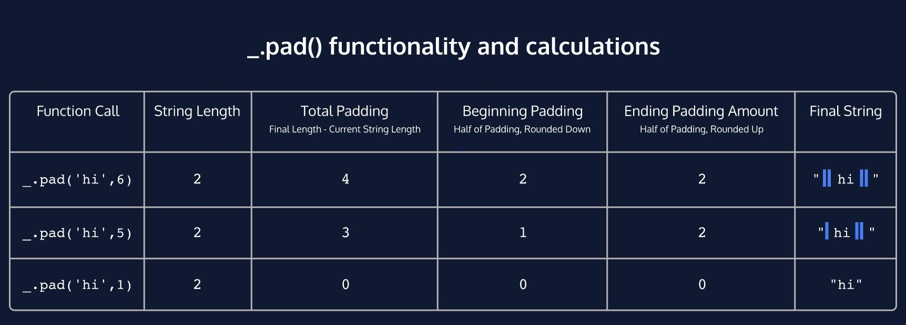
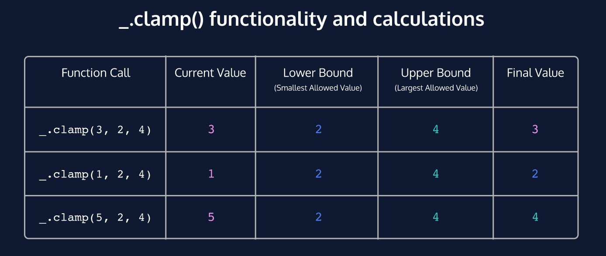
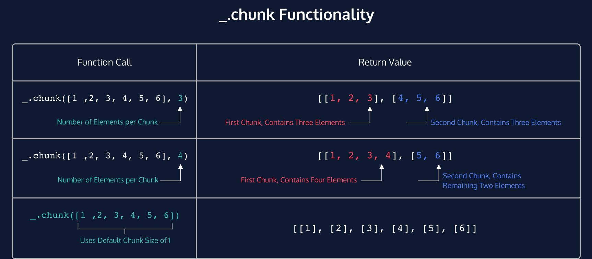

# Lodash
This project implements some of the most exciting functionality from the widely-popular lodash.js library. It features ten methods that add new functionality for numbers, strings, objects, and arrays.

# Instructions
In your console, navigate to the directory and run node test/*method name*.js

## 'Pad.js' functionality

## 'Clamp.js' functionality

## 'Chunk.js' functionality

